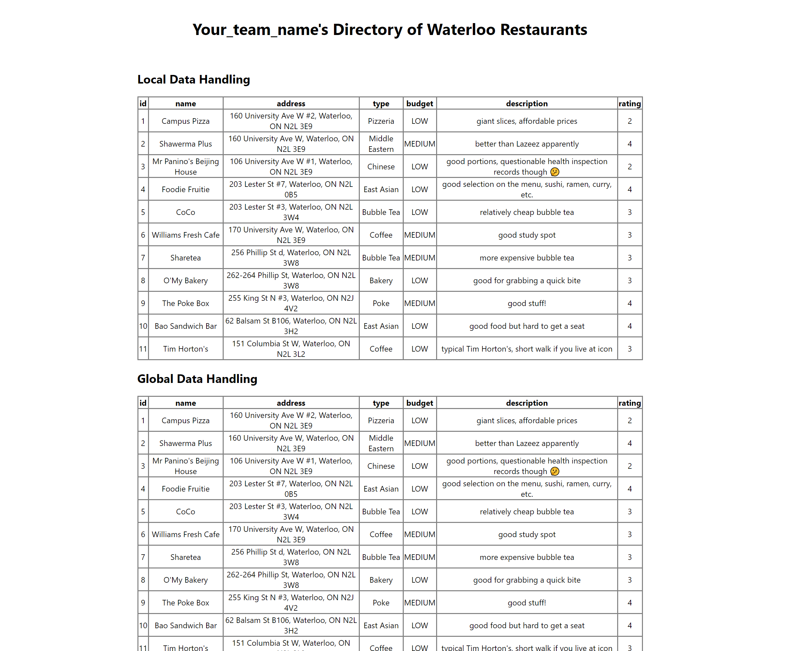

# Bootcamp: PERN Stack (GraphQL Backend)

This repo contains the starter-code for our bootcamp activity.

## Tech Stack

We will be using the PERN stack. These technologies are easy to learn, allow for fast development speeds, and are popularly used in Blueprint.

* Frontend: React + Redux
* Backend: Node.js + Express.js + Apollo Server
* Database: PostgreSQL

## Setup

The dev environment is containerized with Docker to minimize setup efforts.

1. Install Docker Desktop (skip tutorials): [MacOS](https://docs.docker.com/docker-for-mac/install/) | [Windows (Home)](https://docs.docker.com/docker-for-windows/install-windows-home/) | [Windows (Pro, Enterprise, Education)](https://docs.docker.com/docker-for-windows/install/) | [Linux](https://docs.docker.com/engine/install/#server)
```bash
# verify your installation by running the following in a terminal
$ docker --version
$ docker-compose --version
```

2. Clone this repo and go into the project directory
```
$ git clone https://github.com/uwblueprint/bootcamp-pern-graphql.git
$ cd bootcamp-pern-graphql
```

3. Fill in backend environment variables in `/backend/.env.sample`, then rename the file to `.env`. Tip: use `mv <old-filename> <new-filename>`
```
POSTGRES_DB=bootcamp
POSTGRES_USER=<insert-username-of-your-choice>
POSTGRES_PASSWORD=<insert-password-of-your-choice>
DB_HOST=bootcamp-pern-graphql_db_1
```

4. Fill in frontend environment variables in `/frontend/.env.sample`, then rename the file to `.env`
```
REACT_APP_GRAPHQL_SERVER_URL=http://localhost:5000
```

5. Set `eraseDatabaseOnSync` to `true` in `/backend/server.js` so the database will get seeded with test data when we run our application

6. Run the application
```
$ docker-compose up --build
```
7. Set `eraseDatabaseOnSync` back to `false`.

8. Go to http://localhost:3000 in your browser. You should see this:



9. Go to http://localhost:5000/graphql in your browser and verify the playground is up and running:


## Useful Commands for Development

To first setup the application run the following command:

```
$ docker-compose up --build
```

On subsequent runs you can omit the --build tag

```
$ docker-compose up
```

Keep in mind that both the frontend and backend have hot reload enabled so you will rarely need to restart the application.

## Warm Up

**Feel free to skip this section if you've had some experience working with GraphQL before.**

Let's try running our first GraphQL mutation by adding a new restaurant into our directory. GraphQL is a query language and a mutation is an operation used to write data.

Navigate to http://localhost:5000/graphql in a browser, this is our GraphQL Playground. Click on the "DOCS" tab on the right and you should see a couple of "function" signatures. Click on `createRestaurant(...): Restaurant` to see its full signature. To create a restaurant, we simply need to call `createRestaurant(...)` and supply some arguments containing our new restaurant's info. The return value will be our new restaurant. Note the `!` in the type declaration of the `name` parameter. It means `name` is a non-nullable parameter, so we must provide a value.

This is the syntax for a GraphQL mutation:
```graphql
mutation {
  createRestaurant(name: "My New Restaurant", rating: 5) {
    id
    name
    address
    type
    budget
    description
    rating
  }
}
```

The purpose of the first 2 lines should be pretty clear. What about the rest? The fields enclosed in the braces following `createRestaurant(name: "My New Restaurant", rating: 5)` specify the fields of the created restaurant object that we would like to retrieve. In this case, we want to retrieve all available fields (you can view the available fields in the "DOCS" tab).

Now, type the mutation out in the left panel of the GraphQL Playground (don't use copy & paste). You'll notice there's syntax highlighting and auto-completion! Press the run button to run the mutation.

Next, let's try running a GraphQL query. Open "DOCS" again and click on `restaurant(...): Restaurant`. What do you need to do in order to retrieve the restaurant you just created?

## Your Tasks

Following the starter-code's pattern, complete these tasks:

Currently, our restaurant directory maintains a singular list of restaurants. Suppose we now want the ability to create restaurant groups (e.g. "Uni Plaza", "Cafes", "Open Late", etc.).

A single group can contain multiple restaurants, and a single restaurant can be part of multiple groups.

A `RestaurantGroup` model should have these fields: `id`, `name`, `description`, `restaurantIds`*

\* implementation dependent, but the `RestaurantGroup` needs some way of keeping track of its members. **Hint: look into Sequelize [associations](https://sequelize.org/master/manual/assocs.html)**.

1. Using the existing code as a template, create a GraphQL query and mutation for `RestaurantGroup`, enabling create and retrieve operations.

    a. Sample `createRestaurantGroup` mutation:
    ```graphql
    mutation {
        createRestaurantGroup(name: "Open Late", restaurantIds: [3, 1, 4]) {
            id
            name
            description
            restaurants # can return restaurantIds for now, but we will be expanding on this shortly
        }
    }
    ```

    b. Sample `restaurantGroup` query:
    ```graphql
    query {
        restaurantGroup(id: 1) {
            id
            name
            description
            restaurants # can only restaurantIds for now, but we will be expanding on this shortly
        }
    }
    ```

2. Display `RestaurantGroup` data in the frontend (try to reuse existing components to save time, don't worry about design and appearance)

3. If you chose to only return `restaurantIds` previously, modify your solution so that your query and mutation responses include full restaurant information (i.e. member restaurants' names, ratings, descriptions, etc.)

### Tip

For some help with debugging your work, you can use the GraphQL Playground (http://localhost:5000/graphql). It is a browser-based GraphQL IDE providing syntax-highlighting, auto-completion, and documentation! The [Warm Up](#warm-up) gives a quick walk-through of this tool.

Please ASK FOR HELP if you're ever stuck!

### Extensions

1. To support updating a `RestaurantGroup`, create another mutation called `updateRestaurantGroup`.
```graphql
mutation {
    updateRestaurantGroup(id: 1, name: "Edited Name", restaurantIds: [1, 2]) {
        id
        name
        description
        restaurants
    }
}
```

2. To support deleting a `RestaurantGroup`, create another mutation called `deleteRestaurantGroup`. Note we are not selecting fields because the return value is just an ID.
```graphql
mutation {
    deleteRestaurantGroup(id: 1)
}
```

3. Modify the `deleteRestaurant` mutation logic so that deleting a restaurant will result in its removal from all the groups that it was part of
